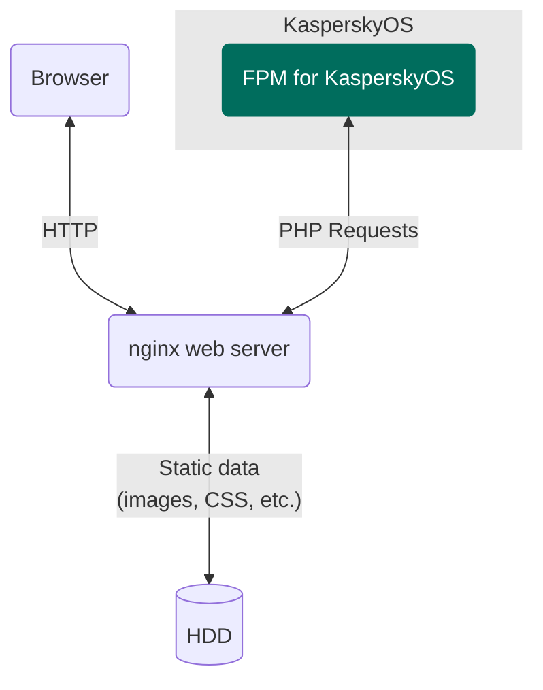

# FPM for KasperskyOS

> FastCGI Process Manager (FPM) is adapted for KasperskyOS.

## Table of contents
- [FPM for KasperskyOS](#fpm-for-kasperskyos)
  - [Table of contents](#table-of-contents)
  - [Solution overview](#solution-overview)
    - [List of programs](#list-of-programs)
    - [Solution scheme](#solution-scheme)
    - [Initialization description](#initialization-description)
    - [Security policy description](#security-policy-description)
  - [Getting started](#getting-started)
    - [Prerequisites](#prerequisites)
    - [Building the example](#building-the-example)
  - [Usage](#usage)

## Solution overview

### List of programs

* `NetInit`—Program that initializes the network interface `en0`
* `Fpm`—FastCGI Process Manager (FPM) adapted for KasperskyOS
* `VfsSdCardFs`—Program that supports SDCardFS file system
* `VfsNet`—Program that is used for working with the network
* `Dhcpcd`—DHCP client implementation program that gets network interface parameters from an external DHCP server in the background and passes them to the virtual file system
* `DCM`—KasperskyOS Native Dynamic Connection Manager
* `SDCard`—Block device driver of the SDCard
* `EntropyEntity`—Random number generator
* `DNetSrv`—Driver for working with network cards
* `GPIO`—GPIO driver (only for Radxa ROCK 3A)
* `BSP`—Board support package driver
* `PinCtrl`—PinCtrl driver (only for Radxa ROCK 3A)
* `Bcm2711MboxArmToVc`—Mailbox driver (only for Raspberry Pi 4 B)

[⬆ Back to Top](#Table-of-contents)

### Solution scheme



[⬆ Back to Top](#Table-of-contents)

### Initialization description

Statically created IPC channels:

* `netinit.NetInit` → `kl.VfsNet`
* `netinit.NetInit` → `kl.VfsSdCardFs`
* `php.Fpm` → `kl.VfsNet`
* `php.Fpm` → `kl.VfsSdCardFs`
* `kl.rump.Dhcpcd` → `kl.VfsNet`
* `kl.rump.Dhcpcd` → `kl.VfsSdCardFs`
* `kl.VfsNet` → `kl.EntropyEntity`
* `kl.VfsNet` → `kl.drivers.DNetSrv`
* `kl.VfsSdCardFs` → `kl.drivers.SDCard`
* `kl.VfsSdCardFs` → `kl.EntropyEntity`
* `kl.drivers.SDCard` → `kl.drivers.BSP`
* `kl.drivers.SDCard` → `kl.drivers.GPIO` (only for Radxa ROCK 3A)
* `kl.drivers.DNetSrv` → `kl.drivers.Bcm2711MboxArmToVc` (only for Raspberry Pi 4 B)
* `kl.drivers.BSP` → `kl.drivers.Bcm2711MboxArmToVc` (only for Raspberry Pi 4 B)
* `kl.drivers.GPIO` → `kl.drivers.PinCtrl` (only for Radxa ROCK 3A)

The [`./einit/src/init.yaml.in`](einit/src/init.yaml.in) template is used to automatically generate a part of the solution initialization description file `init.yaml`. For more information about the `init.yaml.in` template file, see the [KasperskyOS Community Edition Online Help](https://click.kaspersky.com/?hl=en-us&link=online_help&pid=kos&version=1.4&customization=KCE&helpid=cmake_yaml_templates).

[⬆ Back to Top](#Table-of-contents)

### Security policy description

The [`./einit/src/security.psl`](einit/src/security.psl) file contains a solution security policy description. For more information about the `security.psl` file, see [KasperskyOS Community Edition Online Help](https://click.kaspersky.com/?hl=en-us&link=online_help&pid=kos&version=1.4&customization=KCE&helpid=ssp_descr).

[⬆ Back to Top](#Table-of-contents)

## Getting started

### Prerequisites

1. Confirm that your host system meets all the
[System requirements](https://click.kaspersky.com/?hl=en-us&link=online_help&pid=kos&version=1.4&customization=KCE&helpid=system_requirements)
listed in the KasperskyOS Community Edition Developer's Guide.
1. Install the latest versions of the following programs:

    * [KasperskyOS Community Edition SDK](https://os.kaspersky.com/development/)
    * [PHP Interpreter for KasperskyOS](https://github.com/TSDC-TEAM/php-src-kos)
1. Install and configure the nginx web server:
    * Run the following command with root privileges to install the nginx:
      ```
      $ sudo apt install nginx
      ```
    * Create a configuration file `kos-fpm.conf` with the following content:
      ```
      server {
        listen       0.0.0.0:80;
        server_name  localhost;
        root /;

        location ~ \.php$
        {
          fastcgi_pass <ip>:8000;
          fastcgi_param SCRIPT_FILENAME $document_root$fastcgi_script_name;
          include fastcgi_params;
        }
      }
      ```
    * To run the example on QEMU, use localhost (127.0.0.1) as the IP address. When running on the
      board, the IP address is printed in the startup log.
    * Copy the file `kos-fpm.conf` to the directory `/etc/nginx/sites-enabled/`. If the directory `/etc/nginx/sites-enabled/` contains a `default.conf` file, delete the file.
    * Reload nginx using the following command:
      ```
      $ sudo nginx -s reload
      ```
1. Copy the source files of this example to your local project directory.
1. Source the SDK setup script to configure the build environment. This exports the `KOSCEDIR`
  environment variable, which points to the SDK installation directory:
   ```sh
   source /opt/KasperskyOS-Community-Edition-<platform>-<version>/common/set_env.sh
   ```
1. [Build the necessary drivers](https://click.kaspersky.com/?hl=en-us&link=online_help&pid=kos&version=1.4&customization=KCE&helpid=building_radxa_drivers)
from source only if you intend to run this example on Radxa ROCK 3A hardware. This step is not
required for QEMU or Raspberry Pi 4 B.

[⬆ Back to Top](#Table-of-contents)

### Building the example

The FPM for KasperskyOS is built using the CMake build system, which is provided in the KasperskyOS Community Edition SDK.

To build an example to run on QEMU, go to the directory with the example and run the following commands:
```
$ cmake -B build -D CMAKE_TOOLCHAIN_FILE="$KOSCEDIR/toolchain/share/toolchain-aarch64-kos.cmake"
$ cmake --build build --target {kos-qemu-image|sim}
```
where:
* `kos-qemu-image` creates a KasperskyOS-based solution image for QEMU that includes the example;
* `sim` creates a KasperskyOS-based solution image for QEMU that includes the example and runs it.

To build an example to run on a hardware, use the following commands:
```
$ cmake -B build -D CMAKE_TOOLCHAIN_FILE="$KOSCEDIR/toolchain/share/toolchain-aarch64-kos.cmake"
$ cmake --build build --target {kos-image|sd-image}
```
where:
* `kos-image` creates a KasperskyOS-based solution image that includes the example;
* `sd-image` creates a file system image for a bootable SD card.

[./netinit/CMakeLists.txt](netinit/CMakeLists.txt)—CMake commands for building the `NetInit` program.

[./einit/CMakeLists.txt](einit/CMakeLists.txt)—CMake commands for building the `Einit` program and the solution image.

[./CMakeLists.txt](CMakeLists.txt)—CMake commands for building the solution.

[⬆ Back to Top](#Table-of-contents)

## Usage

1. To run the example on QEMU, go to the directory with the FPM example and run the following command:
   ```
   $ cmake --build build --target sim
   ```
   For more information about running the example on hardware see the following
   [link](https://click.kaspersky.com/?hl=en-us&link=online_help&pid=kos&version=1.4&customization=KCE&helpid=running_sample_programs_rpi).
1. Wait until a message like this appears in the standard output:
    ```
    [DD-MMM-YYYY HH:MM:SS.MMMMMM] NOTICE: pid 67, fpm_init(), line 83: fpm is running, pid 67
    ```
1. Open the link <http://localhost/ping.php> in your browser.
1. The page with the title "PHP test page" and plain text "Hello, World!" should open.

[⬆ Back to Top](#Table-of-contents)
